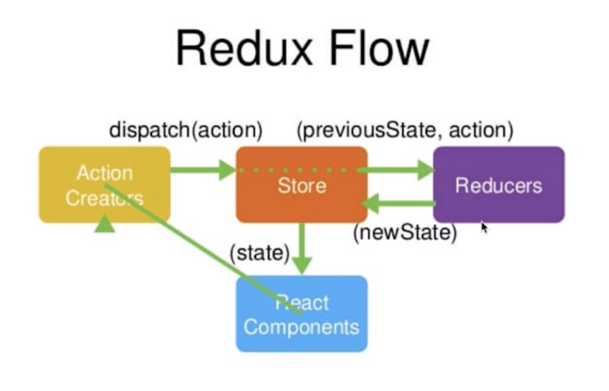

## redux的一些学习

### redux flow


在上图中，可以把`React-component`组件想象成一个借书人，`action-creators`相当于借书动作，`store`相当于一个图书馆管理员，`reducer`相当于管理员的记录本
当发起借书时，`dispatch(action)`，派发借书的动作，`store`接收之后，就去`reducer`中查询借书记录本（对比前后state）,`reducer(state,action)`接收`state`
和`action`，然后将`newState`返回给`store`，`store`更新`state`后将`state`返回给`react-component`

###  结合todo-list实例
1. 在文本框中输入文字的redux过程
在actions/index.js中，定义一个`setTodoText`的action-creators
```
javascript
export const setTodoText = text => ({
  type: SET_TODO_TEXT,
  text
})
```
这个creators函数接收一个text，返回一个`type:SET_TODO_TEXT`的标记以及这个text
2. 在`index.js`中
```const store = createStore(rootReducer, applyMiddleware(thunkMiddleware))```
简单说就是```store(reducer)```，就是管理员和记录本联系在一起
3. 传入到容器型component中
```
javascript
//  把store中的action方法映射到组件中的props
const mapDispatchToProps = (dispatch) => ({
  setTodoText: text => dispatch(setTodoText(text)),
})
```
即调用setTodoText方法会执行一个回调，派发一下action，这个action接收text参数
4. 此时store已经和reducer绑定，在第2步时，他会根据这个action的type，以及传入的text返回一个新state
```
javascript
import {SET_TODO_TEXT} from "../actions/action-type";

const text = (state = '', action) => {
  switch (action.type) {

    case SET_TODO_TEXT:
      return action.text
    default:
      return state
  }
}

export default text
```
5. 容器组件同时监听了state
```
javascript
const mapStateToProps = state => ({
  text: state.text
})
```
此时会更新state，则输入框中的text会随着输入变化
